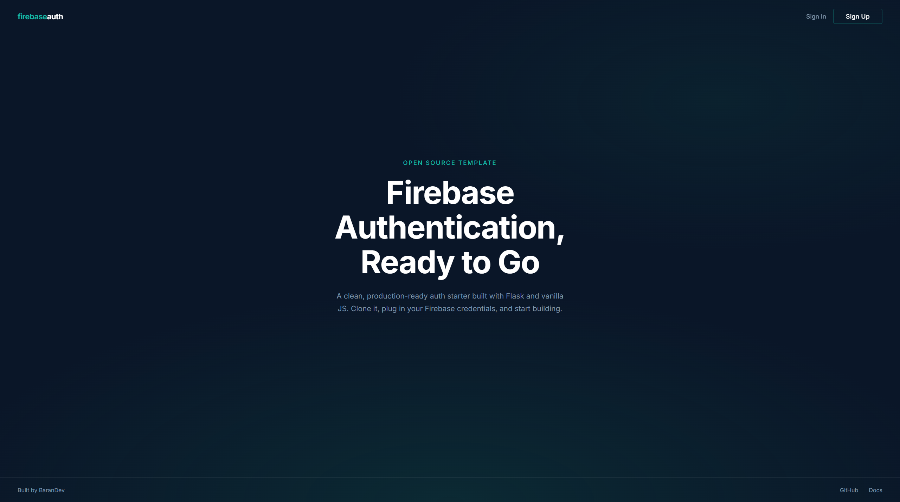

# Firebase Authentication Template

A Flask + vanilla JS template for adding user sign-up, sign-in, and session management to a web app using Firebase Auth. No frameworks, no build tools. Just HTML, CSS, and JavaScript.

## How the auth flow works

Here's what happens step by step when a user signs in:

1. The user fills in their email and password in the browser.
2. `signin.js` sends those credentials to **Firebase Auth** (not to our server). Firebase verifies them and returns a user object containing a UID and email.
3. The JS then makes a `POST` request to our Flask backend at `/set_session`, sending just the UID and email.
4. Flask stores that info in a server-side session cookie. From this point on, the backend knows who is logged in.
5. The browser redirects to `/signedin`, where Flask checks the session and renders the dashboard.

Sign-up works the same way, except it calls `createUserWithEmailAndPassword` instead of `signInWithEmailAndPassword`. Both functions are from the Firebase JS SDK.

When the user signs out, the JS hits `/signout`, Flask clears the session, and the browser goes back to the home page.

## Setup

### What you need before starting

- **Python 3.7 or newer.** Check if you have it by running `python --version` (or `python3 --version` on some systems). If you don't have it, download it from [python.org/downloads](https://www.python.org/downloads/). During installation on Windows, make sure to check "Add Python to PATH".

- **A Firebase project.** This is free. You will create one in the steps below if you don't already have one.

### Step 1: Clone the repository

```bash
git clone https://github.com/barandev/Firebase-Authentication-Template.git
cd Firebase-Authentication-Template
```

### Step 2: Create a Firebase project

If you already have a Firebase project, skip to Step 3.

1. Go to [console.firebase.google.com](https://console.firebase.google.com) and sign in with your Google account.
2. Click **Create a project** (or **Add project**).
3. Give it a name, like "my-auth-app". You can disable Google Analytics if you don't need it.
4. Wait for the project to be created, then click **Continue**.

### Step 3: Enable Email/Password authentication

1. In the Firebase Console, open your project.
2. In the left sidebar, click **Build** then **Authentication**.
3. Click the **Sign-in method** tab.
4. Click **Add new provider** button.
5. Click **Email/Password**.
6. Toggle the first switch to **Enable** it. You can leave "Email link (passwordless sign-in)" disabled.
7. Click **Save**.

### Step 4: Register a web app and get your config values

1. In the Firebase Console, click the **gear icon** next to "Project Overview" in the top-left corner, then select **General**.
2. Scroll down in the **General** tab to the **Your apps** section. If you don't see any apps listed, click the **web icon** (`</>`) to register a new web app.
3. Give the app a nickname (like "auth-template"). You don't need to set up Firebase Hosting (in production you can use Firebase Hosting or any other hosting provider).
4. Click **Register app** button.
5. Firebase will show you a code snippet. The part you need looks like this:

```js
// Import the functions you need from the SDKs you need
import { initializeApp } from "firebase/app";
// TODO: Add SDKs for Firebase products that you want to use
// https://firebase.google.com/docs/web/setup#available-libraries

const firebaseConfig = {
  apiKey: "AIzaSy...",
  authDomain: "my-auth-app.firebaseapp.com",
  databaseURL: "https://my-auth-app-default-rtdb.firebaseio.com",
  projectId: "my-auth-app",
  storageBucket: "my-auth-app.appspot.com",
  messagingSenderId: "123456789",
  appId: "1:123456789:web:abc123",
  measurementId: "G-XXXXXXX" // optional
};

// Initialize Firebase
const app = initializeApp(firebaseConfig);
```

Keep this page open. You will copy these values into your `.env` file in the next step.

### Step 5: Set up your .env file

The repo includes a file called `.env.example` with placeholder values. You need to create a real `.env` file with your actual credentials.

**On macOS/Linux:**
```bash
cp .env.example .env
```

**On Windows (Command Prompt):**
```cmd
copy .env.example .env
```

**On Windows (PowerShell):**
```powershell
Copy-Item .env.example .env
```

Well, you can just duplicate `.env.example` manually and rename the copy to `.env` if you're using an OS with a GUI. I'm not judging.

Now open `.env` in your editor and replace each placeholder with the matching value from the Firebase config snippet you got in Step 4:

```
FIREBASE_API_KEY="AIzaSy..."
FIREBASE_AUTH_DOMAIN="my-auth-app.firebaseapp.com"
FIREBASE_PROJECT_ID="my-auth-app"
FIREBASE_STORAGE_BUCKET="my-auth-app.appspot.com"
FIREBASE_MESSAGING_SENDER_ID="123456789"
FIREBASE_APP_ID="1:123456789:web:abc123"
FIREBASE_DATABASE_URL="https://my-auth-app-default-rtdb.firebaseio.com" (you will have to follow 5.1 to get this value)
FIREBASE_MEASUREMENT_ID="G-XXXXXXX" (you will have to follow 5.2 to get this value, optional)
```

### Step 5.1: Enable Realtime Database

1. Click **Continue to console** after filling out the values in step 5. (or just select your project)
2. In the left sidebar, click **Build** then **Realtime Database**.
3. Click the **Create database** button.
4. Select a location (e.g., "europe-west1").
5. Click **Start in test mode** (you can change this later).
6. Click the **Copy reference url** button at the top-center of the page, or go back to **Project Settings** and scroll down to see **databaseURL** entry added to the config values.
7. Paste the database URL (it will look like `https://my-auth-app-default-rtdb.firebaseio.com`), make sure to remove the '/' at the end, into your `.env` file as the value for `FIREBASE_DATABASE_URL`.
You also need to set `FLASK_SECRET_KEY` at the bottom of the file. This is used to sign session cookies. Generate a random one by running:

```bash
python -c "import secrets; print(secrets.token_hex(32))"
```
> It will look like `a1b2c3d4e5f6g7h8i9j0k1l2m3n4o5p6`, or you can use any random string of characters for testing.
Copy the output and paste it as the value:

```
FLASK_SECRET_KEY="paste-your-generated-key-here"
```

### Step 5.2: Get the measurement ID (optional)

1. In the Firebase Console, click **Continue to console** after filling out the values in step 5. (or just select your project)
2. Click the gear button in the top-left corner.
3. Click the **General** button
4. Navigate to **Integrations** button
5. Click **Enable** on **Google Analytics**
   1. If you don't have a Google Analytics account, you will be prompted to create one.
   2. Select a name for the account, like "my-auth-app-analytics".
   3. Select a location (e.g., "United States").
   4. Leave the **Use the default settings for sharing Google Analytics data.** and accept terms.
   5. Click the **Enable Google Analytics** wait for some time, then click **Finish**.
6. After that go back to **Project Settings** and scroll down to see **measurementId** entry added to the config values.
7. Paste the measurement ID (it will look like `G-XXXXXXX`), into your `.env` file as the value for `FIREBASE_MEASUREMENT_ID`.

### Step 6: Install Python dependencies

```bash
pip install -r requirements.txt
```

This installs Flask (the web server) and python-dotenv (which reads your `.env` file).

### Step 7: Run the app

```bash
python main.py
```

You should see output like:

```
 * Running on http://127.0.0.1:8080
```

Open [http://localhost:8080](http://localhost:8080) in your browser. You should see the home page with Sign In and Sign Up buttons in the top-right corner. Try creating an account, if everything is wired up correctly, you will be redirected to the dashboard after signing up.

## Project structure

```
Firebase-Authentication-Template/
├── main.py                     # Flask server: routes, session handling, serves Firebase config
├── requirements.txt            # Python deps (flask, python-dotenv)
├── .env.example                # Template for your environment variables
├── .gitignore                  # Keeps .env and generated files out of git
│
├── templates/
│   ├── template.html           # Home page (has sign-in and sign-up as modals)
│   ├── signin.html             # Standalone sign-in page (same logic, different layout)
│   ├── signup.html             # Standalone sign-up page
│   └── signedin.html           # Dashboard shown after login
│
└── static/
    ├── css/
    │   └── style.css           # All styles, organized by section
    └── js/
        ├── firebase-config.js  # Initializes the Firebase SDK
        ├── signin.js           # Handles the sign-in form submit
        ├── signup.js           # Handles the sign-up form submit
        ├── signout.js          # Handles the sign-out button click
        └── script.js           # Empty utility file for your own helpers
```

## Understanding the code

### Where Firebase gets initialized

`firebase-config.js` fetches the Firebase config from the Flask backend (`/firebase_config`) and initializes the app. This way your config values stay in `.env` instead of being hardcoded in JS files.

It uses top-level `await`, which means `auth` is fully ready by the time `signin.js` or `signup.js` imports it. If you want to add Firestore, Storage, or other Firebase services, this is the file to do it in, there are commented examples inside.

### How sign-in and sign-up work

Both `signin.js` and `signup.js` follow the same pattern:

1. Listen for form submit.
2. Grab the email and password from the input fields.
3. Call the appropriate Firebase Auth function.
4. On success, send `{ uid, email }` to `/set_session` so Flask can track the user.
5. Redirect to `/signedin`.
6. On failure, show the user an error message based on the Firebase error code.

**A note on element IDs:** The standalone pages (`signin.html`, `signup.html`) and the modals in `template.html` use the same IDs (`#signin-email`, `#signin-password`, etc.). This means a single JS file works for both layouts. If you only need one approach, you can safely delete the other.

### How sessions work

When the user logs in, the JS sends their UID and email to Flask's `/set_session` endpoint. Flask stores this in a server-side session (backed by a signed cookie). Protected routes like `/signedin` check `session.get("user")`, if it's empty, the user gets redirected to sign in.

The session secret key comes from `FLASK_SECRET_KEY` in your `.env`. If you don't set one, Flask generates a random key on startup, which means all sessions get invalidated every time the server restarts.

## Making it your own

### Changing the look

All styles live in `static/css/style.css`. The file is split into labeled sections (variables, body, typography, navbar, modals, forms, dashboard) and uses CSS custom properties (variables) defined in `:root` at the top. To change the color scheme, just update the `--bg`, `--accent`, and `--text` values there. The background uses CSS radial gradients, so you can tweak or replace them without touching any external files.

### Adding new pages

1. Create a new `.html` file in `templates/`.
2. Add a route in `main.py`:

```python
@app.route("/my-page")
def my_page():
    return render_template("my-page.html")
```

If the page should be protected (only visible to logged-in users), check the session first:

```python
@app.route("/my-page")
def my_page():
    user = session.get("user")
    if not user:
        return redirect("/signin")
    return render_template("my-page.html", user=user)
```

### Adding Google or GitHub sign-in

1. Enable the provider in Firebase Console > Authentication > Sign-in method.
2. In your JS file, import the provider and call `signInWithPopup`:

```js
import { GoogleAuthProvider, signInWithPopup } from "https://www.gstatic.com/firebasejs/10.8.0/firebase-auth.js";
import { auth } from "./firebase-config.js";

const provider = new GoogleAuthProvider();
const result = await signInWithPopup(auth, provider);
// result.user has the same shape as email/password sign-in
```

The rest of the flow (sending user data to `/set_session`, redirecting) stays exactly the same.

## Things to keep in mind

- **Never commit your `.env` file.** It's already in `.gitignore`, but double-check before pushing. The `.env.example` file is safe to commit since it only has placeholder values.
- **Change the secret key.** The default `FLASK_SECRET_KEY` placeholder is not secure. Generate a real one with `python -c "import secrets; print(secrets.token_hex(32))"`.
- **Don't hash passwords yourself.** Firebase Auth handles password hashing and salting on their servers. Hashing on the client side before sending to Firebase would just make the hash your actual password, which breaks things like password reset.
- **Debug mode is off by default.** If you want Flask's auto-reload and debugger during development, set `FLASK_DEBUG=true` in your `.env`. Don't leave this on in production.
- **For production, use a proper server.** The built-in Flask dev server is not meant for real traffic. Use something like gunicorn: `gunicorn main:app --bind 0.0.0.0:8080`.

## Contributing

If you find a bug or want to add something, fork the repo, make your changes on a branch, and open a pull request.

## License

MIT. See [LICENSE](LICENSE) for the full text.